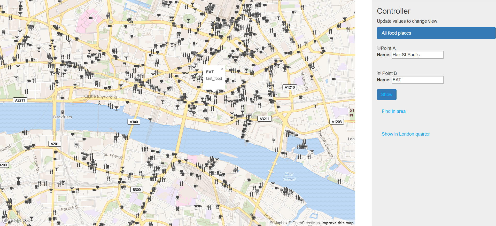

# Overview

Application shows restaurants, cofes, pubs and fast- foods in London.

Scenarios:
- Select two food points from map and show way, how to get from one place to another. Application also shows distances between points and road.
- Show nearby food points around selected pointed on map.
- Show food places at some part of London.

Screenshot of application:

Skeleton of application is created using Express generator, Angular and Node.js. Client of this application is using mapbox API and the backend is written in JavaScript with PostGIS database.

# Frontend
The frontend application is HTML page. It was created using Angular and Express. There is menu and mapbox on the screen. By clicking tabs in menu can user be linked to map, which is suited for another scenario. Map is showing London food places. Therefore I decided to use Bright style. It is useful because we want to see buildings that are in the city. It also nicely shows street names. Food places are also visible well on this type of map.

Frontend' s responsibility is detecting user inputs which are done on the map, displaying data and providing interaction in mapbox and menu. It is also responsible for calling appropriate backend APIs.

# Backend

The backend of application is written in JavaScript. It is responsible for adding data to mapbox and also all the work with processing them. Communication with PostGIS is done via Node- Postgres.

## Data

Data about food places in London was downloaded from [geofabrik](https://download.geofabrik.de/europe/great-britain/england/greater-london.html). It contains all data about Greater London. It was downloaded in greater-london-latest.osm.bz2 format and then added to PostGIS database.

Indices were created on columns 'way' and 'name' in all the tables. GeoJSON is generated by using ST_AsGeoJSON, which provides the requested format. It can be easily inserted into mapbox. Data, that had different data type (not geometry) were used to sort and describe GeoJSON data.

## Api

**Find food places in 1000 m area**

`GET http://localhost:3000/index.html?lng=-0.06934189974165861&lat=51.496298146252514&area=1000`

Query:

    ('SELECT name, ST_AsGeoJSON(ST_Transform(way, 4326)), amenity FROM planet_osm_point WHERE ST_DWithin(ST_Transform(way, 2163), ST_Transform(ST_SetSRID(ST_MakePoint(($1), ($2)),4326), 2163), ($3)) and name is not null and amenity in (\'restaurant\', \'cafe\', \'fast_food\', \'pub\')',[lat, lng, area]);

**Find road, which is closest to two points**

`GET http://localhost:3000/line.html?idA=5335200242&idB=694510208`

Query:

    ('SELECT ST_AsGeoJSON(st_transform(ST_ClosestPoint(le.line, pe.way),4326)) as A_onLine, st_distance(le.line, pe.way) as A_toLine, ST_AsGeoJSON(st_transform(pe.way, 4326)) as A, st_length(le.line) as LineLength, ST_AsGeoJSON(st_transform(le.line, 4326)) as finalLine, le.dist as B_toLine, ST_AsGeoJSON(le.B) as B, ST_AsGeoJSON(le.PointBonLine) as B_online from (select st_transform(ST_ClosestPoint(l.way, p.way), 4326) as pointBonLine, st_transform(p.way, 4326), st_distance(l.way, p.way) as dist, l.way as line, st_transform(p.way, 4326) as b from planet_osm_point p, planet_osm_line l where p.osm_id = ($1) and st_distance(l.way, p.way) < 1000) as le, planet_osm_point pe where pe.osm_id = ($2) and st_distance(le.line, pe.way) <1000 order by st_distance(le.line, pe.way) asc, le.dist asc, le.line asc limit 5',[idB, idA]);

**Find food places in London region**

`GET http://localhost:3000/regionPoints.html?region=City%20of%20Westminster`

Query:

      ('SELECT r.name, ST_AsGeoJSON(ST_Transform(r.way,4326)), r.amenity from planet_osm_polygon p, planet_osm_point r where ST_Contains(p.way, r.way) and r.name is not null and r.amenity in (\'restaurant\', \'cafe\', \'fast_food\', \'pub\') and p.name = ($1)',[region]);